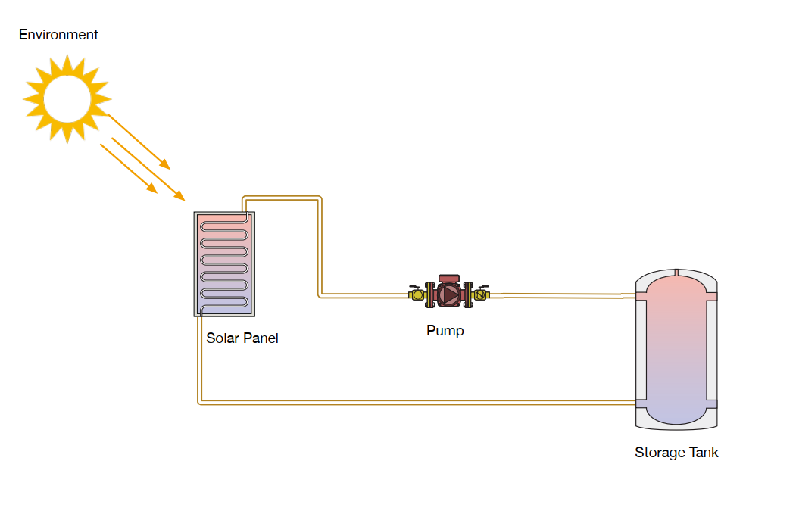
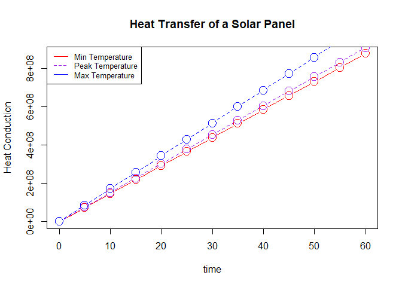
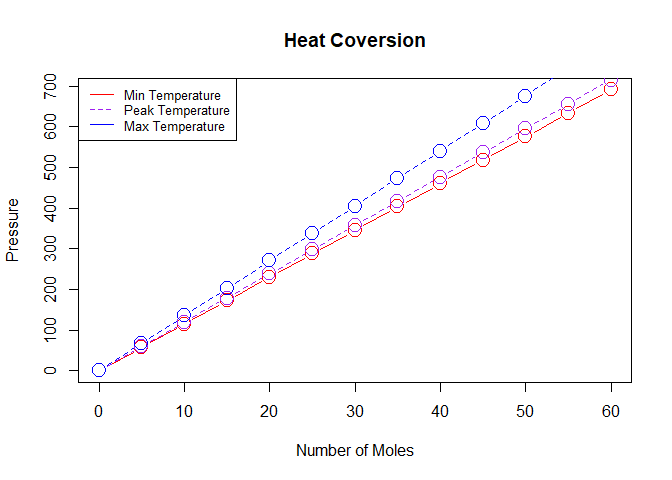

<!--  
    Solar Sim - Readme.Rmd
    
    Copyright 2021 Kyle Tolliver

    This program is free software: you can redistribute it and/or modify
    it under the terms of the GNU General Public License as published by
    the Free Software Foundation, either version 3 of the License, or
    (at your option) any later version.

    This program is distributed in the hope that it will be useful,
    but WITHOUT ANY WARRANTY; without even the implied warranty of
    MERCHANTABILITY or FITNESS FOR A PARTICULAR PURPOSE.  See the
    GNU General Public License for more details.

    You should have received a copy of the GNU General Public License
    along with this program.  If not, see <https://www.gnu.org/licenses/>.
-->


```r
library(mosaic)
library(car)
library(DT)
library(pander)
library(tidyverse)
library(data.table)

A <- 1.67 # Average Area of a Solar Panel
d <- 0.0127 # 1/2in pipe thickness
R <-  8.3145 # universal gas constant
Na <-  6.0221e23 # Avogadro's number
kj <-  1.38066e23 # Boltzmann constant
kev <-  8.617385e-5 # Boltzmann constant
# Tempatures in Kelvin
Tmin <- ((59) − 32) * 5/9 + 273.15
Tmax <- ((149) − 32) * 5/9 + 273.15
Tpeak <-  (77 − 32) * 5/9 + 273.15
```

## Requirements

*Write a simple software simulation of the following system.*

*	The system should simulate the heat transfer from a solar panel to a storage tank
*	Use whichever coding language you wish
*	We will evaluate thermodynamic correctness, code approach, and result



## System {.tabset .tabset-pills .tabset-fade}

### Heat Conduction

#### Equation

$$
\frac{Q}{t} = \frac{\kappa A T}{d}
$$

#### R code

* ```Q <- t * kappa * A * T / d```

#### Simulation


```r
# Data Frames
time <-  c(0, 5, 10, 15, 20, 25, 30, 35, 40, 45, 50, 55, 60)
therm <- read_csv("Kappa.csv")
kappa <- as.numeric(therm %>% 
  filter(Material == "Copper") %>%  # Most Pipes are Copper
  select(`Thermal conductivity`))
# Heat Conduction
Qmin <- time * kappa * A * Tmin / d
Qpeak <- time * kappa * A * Tpeak / d
Qmax <- time * kappa * A * Tmax / d
# Plot
plot(time, Qmin, col = "Red", main = "Heat Transfer of a Solar Panel", 
     ylab = "Heat Conduction", xlab = "time", cex = 2, type = "b", lty = 1)
lines(time, Qpeak, col = "Purple", cex = 2, type = "b", lty = 2)
lines(time, Qmax, col = "Blue", cex = 2, type = "b", lty = 2)
legend(x = "topleft", legend=c("Min Temperature", "Peak Temperature", "Max Temperature"), 
       col=c("red", "purple", "blue"), cex = 0.8, lty = 1:2)
```

<!-- -->

### Ideal Gas Law

#### Equation

$$
PV = nRT = NkT
$$

#### R code

* ```P <- nRT/V```
* ```P <- NkT/V```
* ```V <- nRT/P```
* ```V <- NkT/P```

#### Simulation


```r
# Data Frames
n <-  c(0, 5, 10, 15, 20, 25, 30, 35, 40, 45, 50, 55, 60)
V <- 208.198
# Heat Conversion
Pmin <- n * R * Tmin / V
Ppeak <- n * R * Tpeak / V
Pmax <- n * R * Tmax / V
# Plot
plot(n, Pmin, col = "Red", main = "Heat Coversion", 
     ylab = "Pressure", xlab = "Number of Moles", cex = 2, type = "b", lty = 1)
lines(n, Ppeak, col = "Purple", cex = 2, type = "b", lty = 2)
lines(n, Pmax, col = "Blue", cex = 2, type = "b", lty = 2)
legend(x = "topleft", legend=c("Min Temperature", "Peak Temperature", "Max Temperature"), 
       col=c("red", "purple", "blue"), cex = 0.8, lty = 1:2)
```

<!-- -->

### Kinetic Energy

#### Equation

$$
KE = \frac{3kT}{2} = \frac{3RT}{2}
$$

#### R code

* ```KE <- 3 / 2 * k * T```
* ```KE <- 3 / 2 * R * T```

#### Simulation


```r
pander(data.frame(
  Type = c("Min","Peak","Max"),
  Energy = c(3 / 2 * R * Tmin, 3 / 2 * R * Tpeak, 3 / 2 * R * Tmax),
  Temperature = c(Tmin, Tpeak, Tmax)
))
```


-----------------------------
 Type   Energy   Temperature 
------ -------- -------------
 Min     3594       288.1    

 Peak    3718       298.1    

 Max     4217       338.1    
-----------------------------

##

<br/><br/><hr/>

#### Assumptions

* The solar panel is a standard average panel
* The pipe is made of copper
* The whole system is fully insulated
* The storage tank is a standard water heater tank
* The system is constantly pumping


<br/><br/>
